## Установите операционную систему

1. В пункте меню выберите установку и изучите экран **"Обзор установки"**
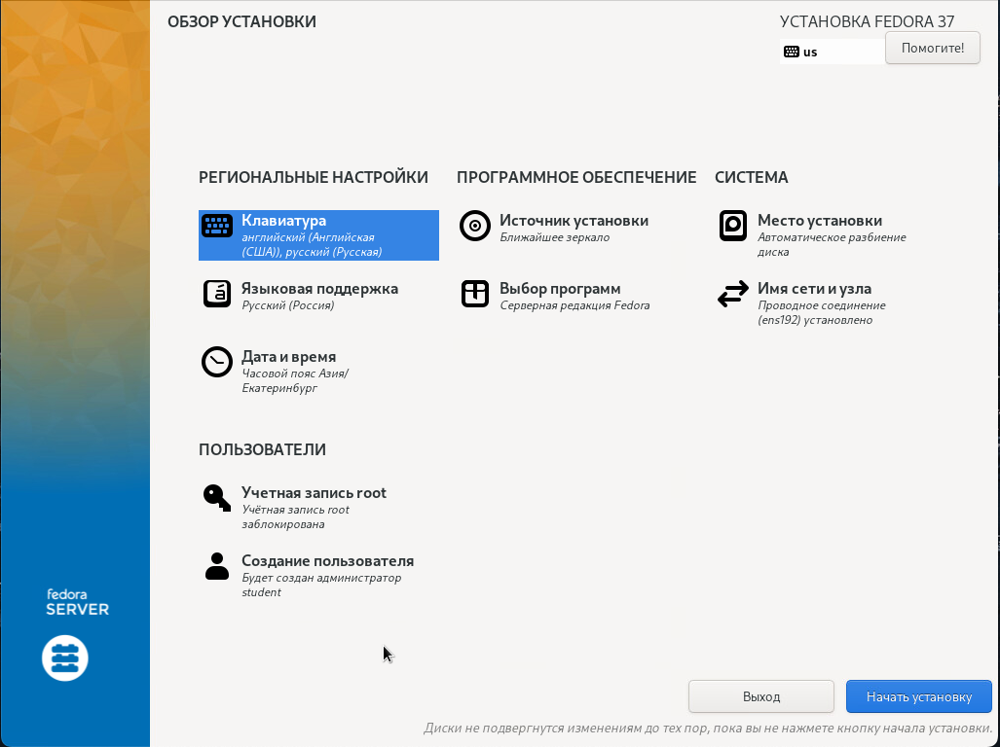

2. Задайте порядок раскладки клавиатуры: **английская, русская**
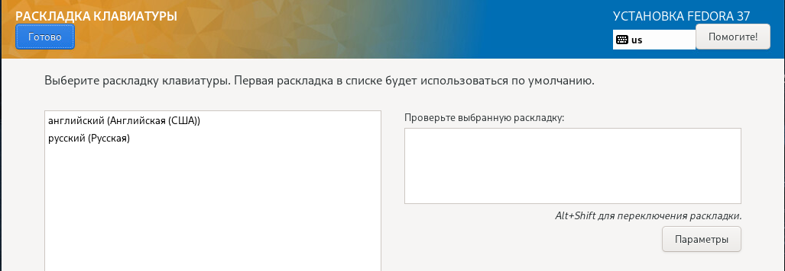
3. Языковая поддержка: укажите **"русская"**
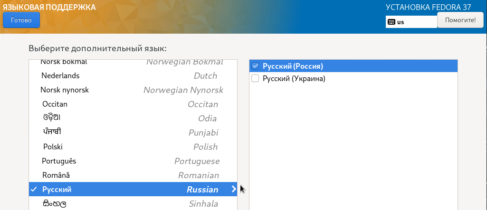
4. Задайте **часовой пояс вашего региона**
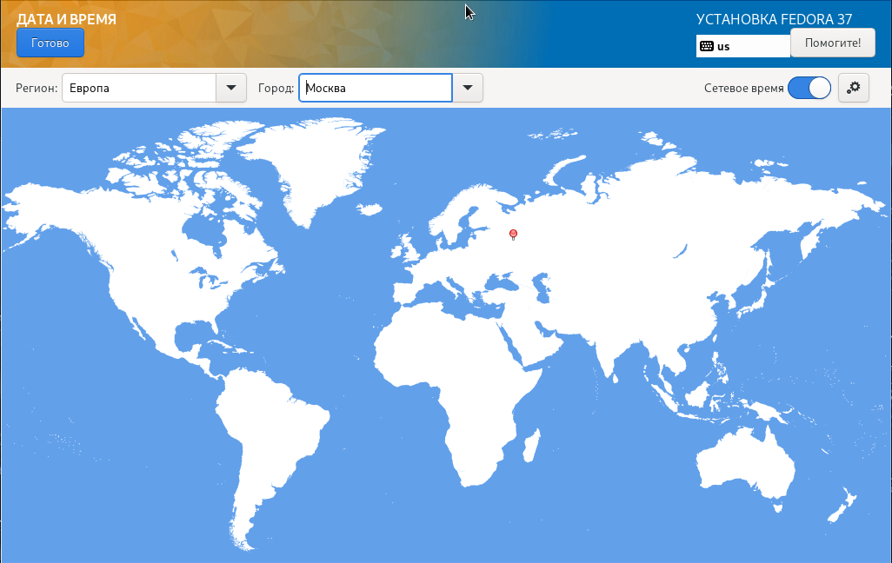
5. Перейдите в **"Место установки"**. Выберите первый диск и укажите конфигурацию устройств хранения **"По-своему"**. Нажмите **"Готово"**.
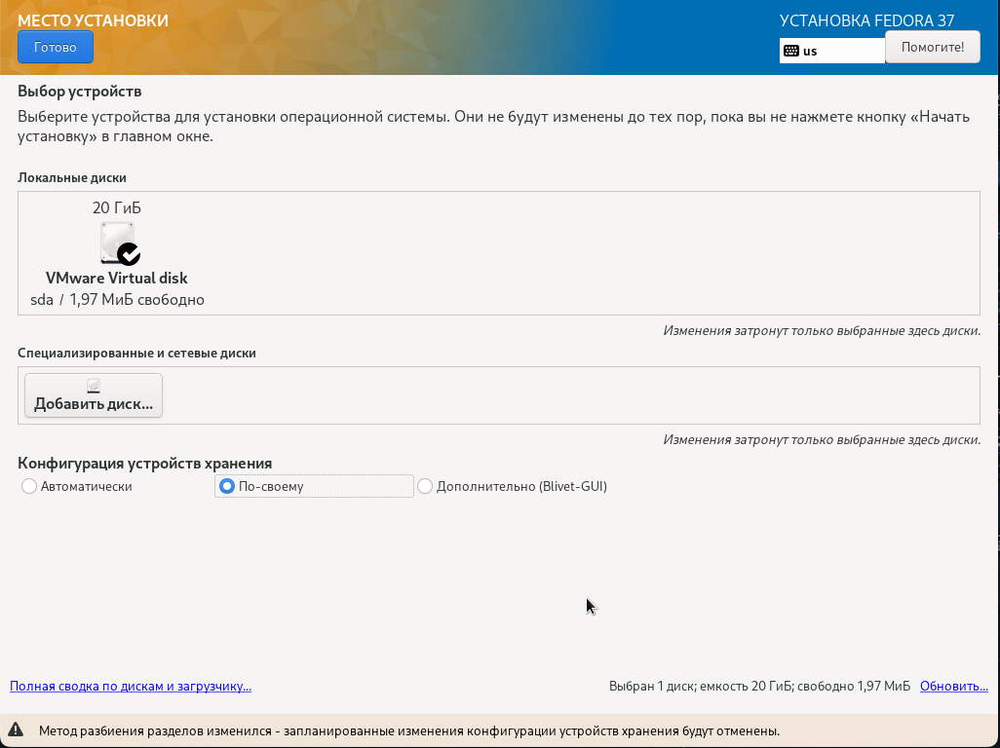
6. Убедитесь, что "Схема разбиение для новых точек монтирования" = **LVM**
Нажмите "Создать их автоматически"
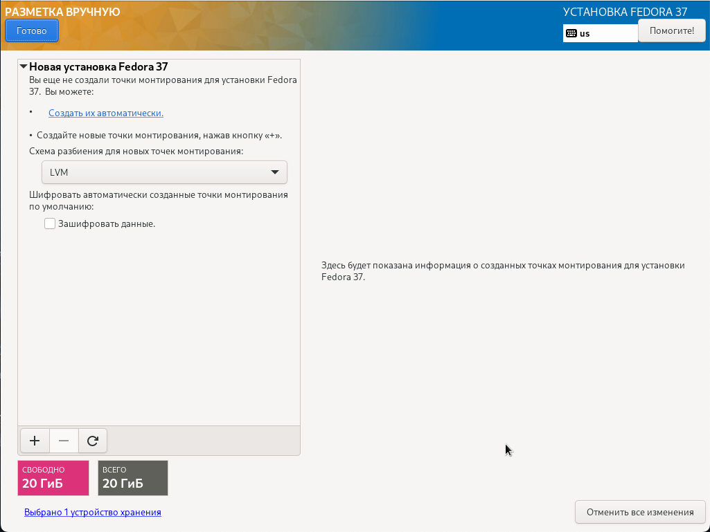
7. Создайте разделы на диске в дополнение к существующим:

```bash
/ - 10GiB
/home - 1GiB
/tmp - 400MiB
/srv - 1GiB
/var - 5GiB
swap - 1GiB
```

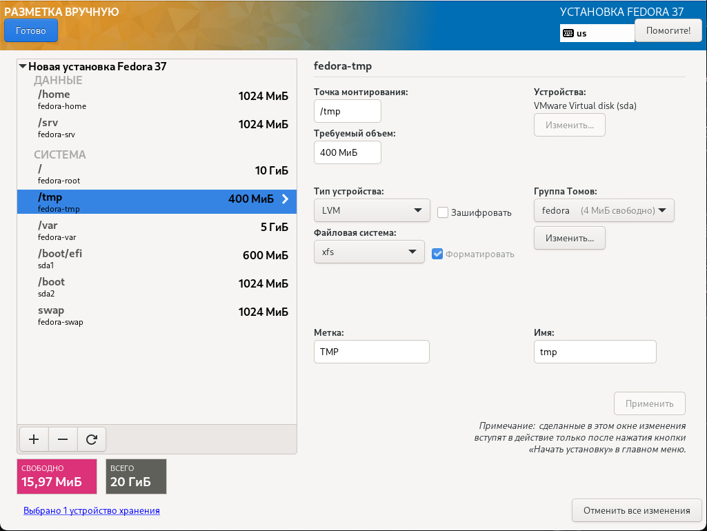
8. Для создания точки монтирования необходимо нажать "**+**" 
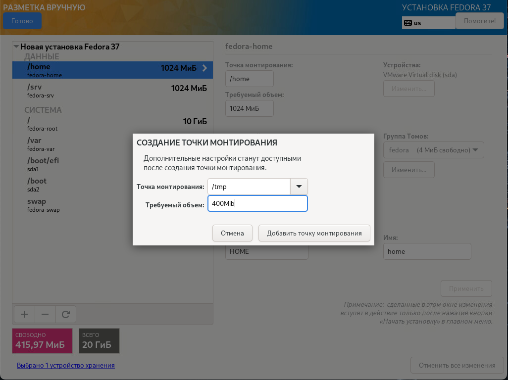
9. Подтвердите изменения на диске
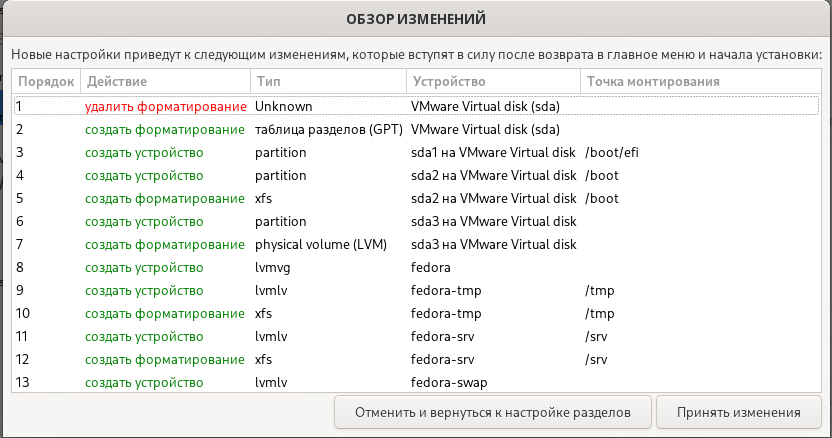
10. Задайте имя узла и **включите сетевой адаптер** в разделе "Сеть и имя узла". Убедитесь, что вы получили корректные настройки сети от dhcp или задайте их вручную.
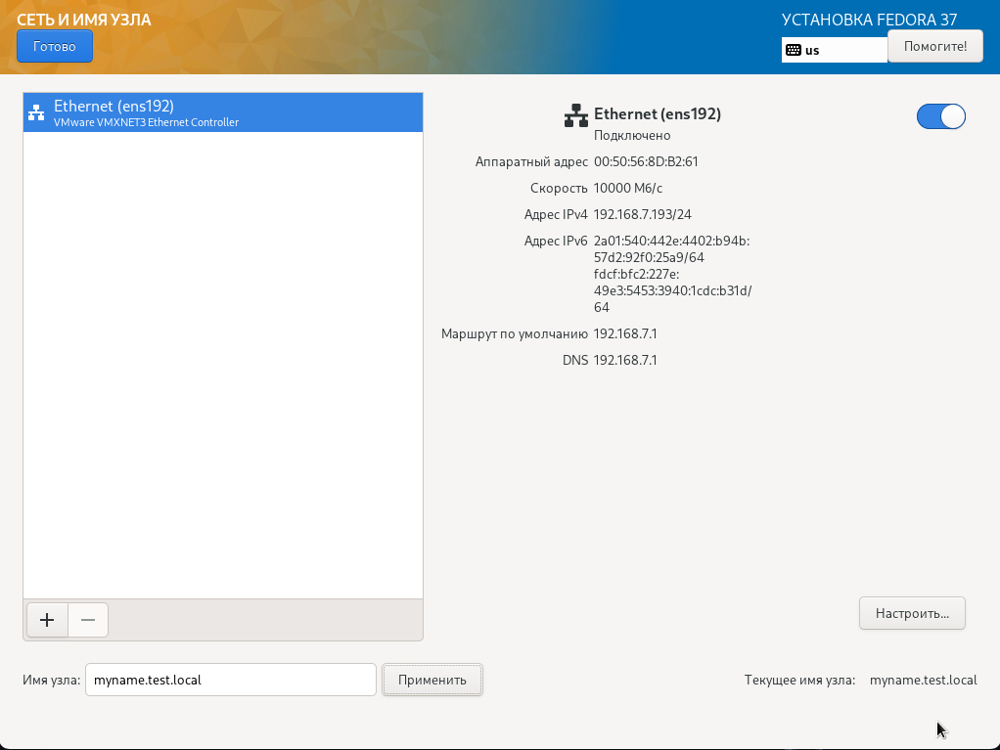

11. В "Выборе программ" укажите предпочитаемое **базовое окружение**
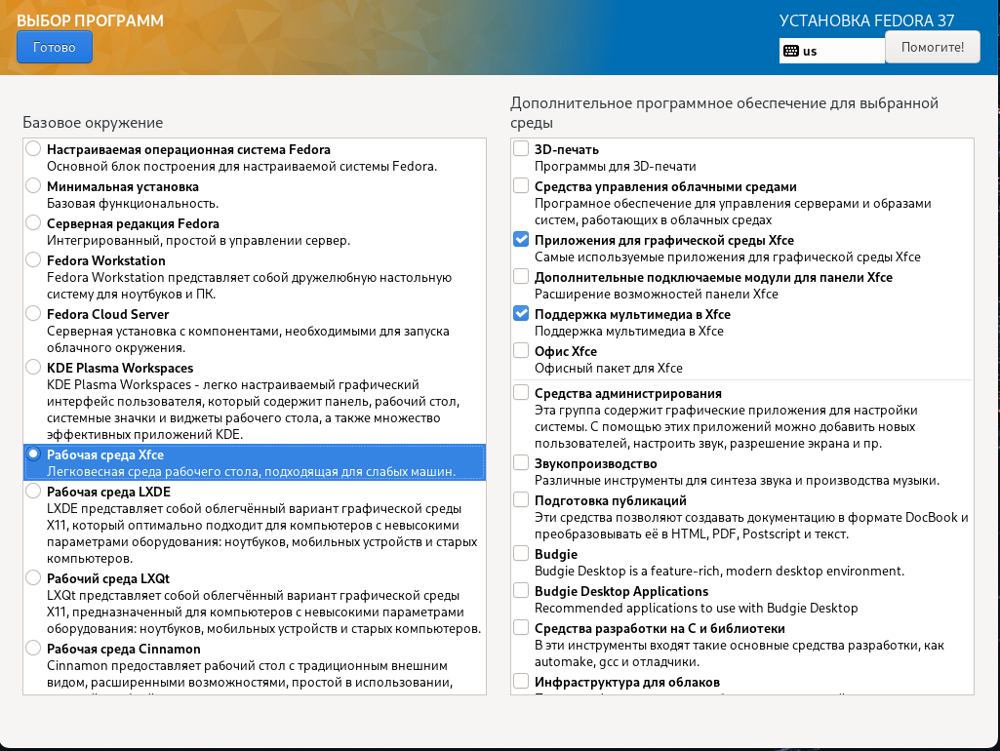
12. В качестве дополнительного ПО добавьте **"Средства администрирования"**
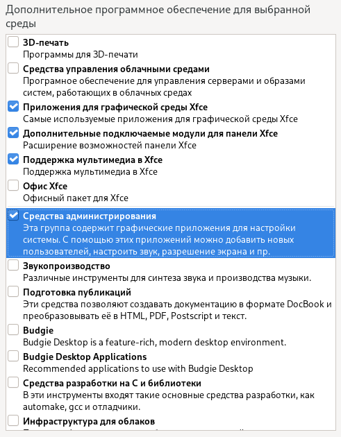
13. В качестве дополнительного ПО добавьте **"Средства разработки", "Редакторы", "Управление без монитора"**
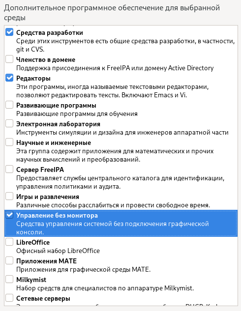
14. В качестве дополнительного ПО добавьте **"Системные средства", "Текстовые средства Интернет", "Оконные менеджеры"**
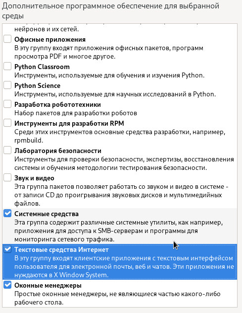

15. Создайте первого пользователя **student** c паролем **redhat**
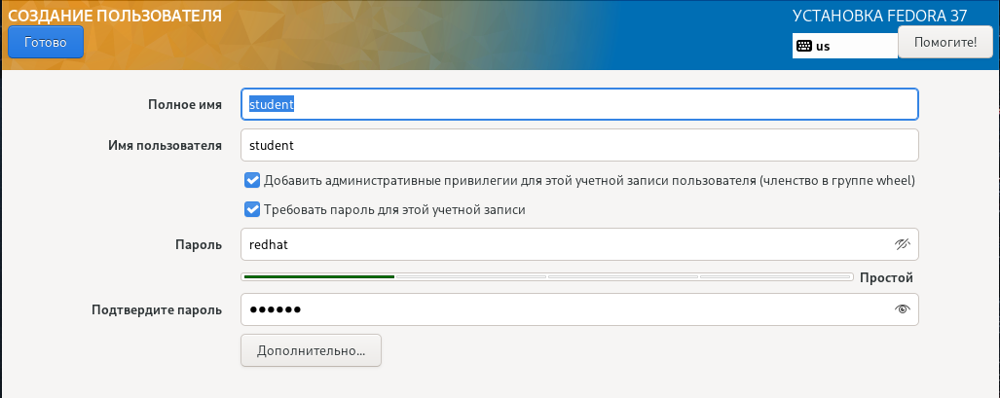

16. Убедитесь, что учетная запись **root** отключена
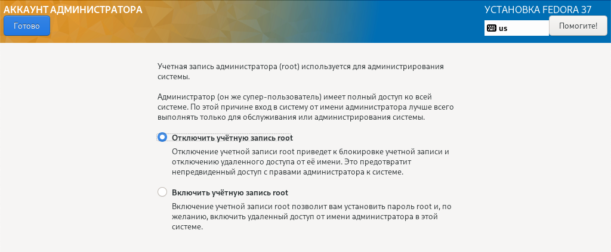

17. Начните установку. После окончание установки перезагрузите сервер


18. Войдите под пользователем **student** в графическое окружение сервера.
