##LAB02-1. Изучение возможностей работы с системой
Войдите в систему под учётной записью student (используйте пароль предоставленный тренером)

В меню "Приложения" найдите ярлык "Диспетчер настроек" и найдите утилиту "Дисплей". Измените разрешение монитора на комфортное для вас.
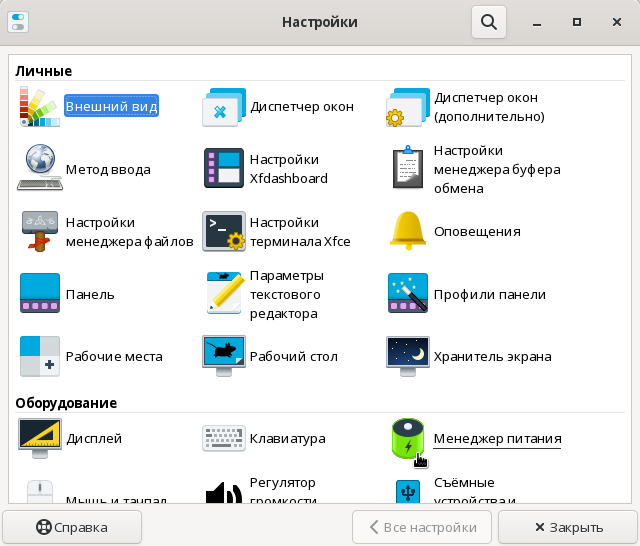

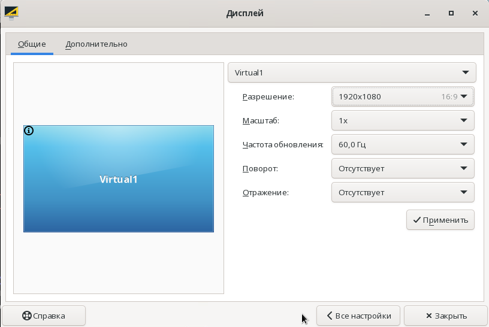

В меню "Приложения" найдите ярлык "Диспетчер настроек" и найдите утилиту "Хранитель экрана".
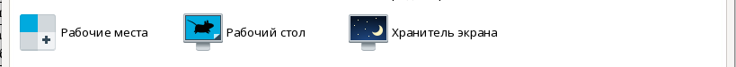 

Отключите блокировку экрана на второй вкладке приложения.
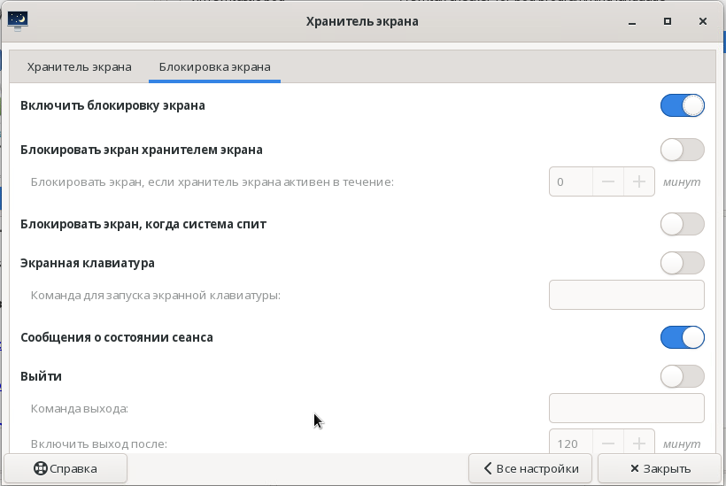

Заблокируйте экран. Что произошло.
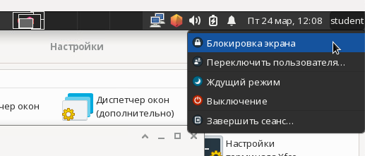

В приложении "Хранитель экрана" поменяйте настройки блоировки, так, чтобы экран блокировался по требованию, но не хранителем экрана. Проверьте блокировку.
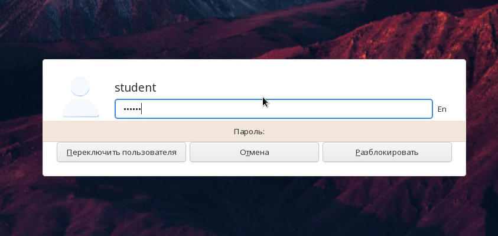

Попробуйте заблокировать экран с помьщью горячих клавиш. Где можно увидеть и изменить комбинацию клавиш для блокировки?
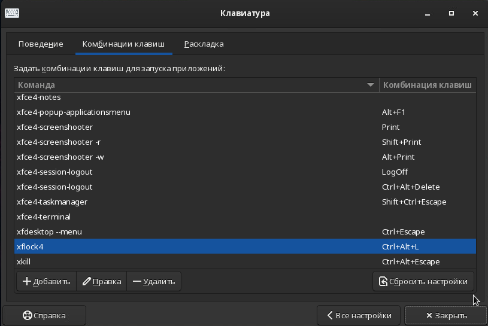

В меню "Приложения" найдите ярлык запускающий эмулятор терминала
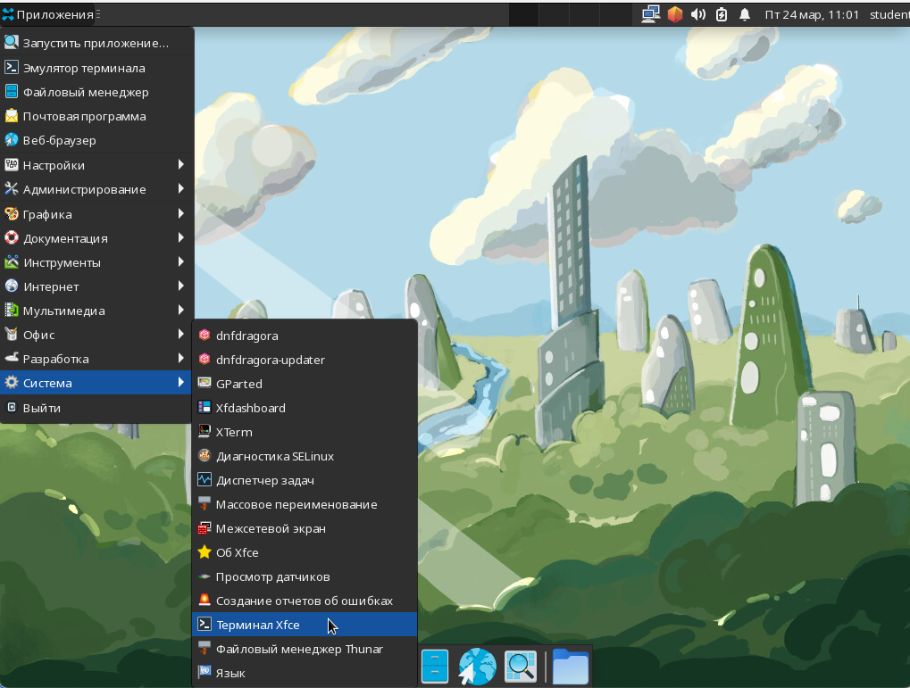

С помощью команды ls просмотрите содержимое каталога /etc/
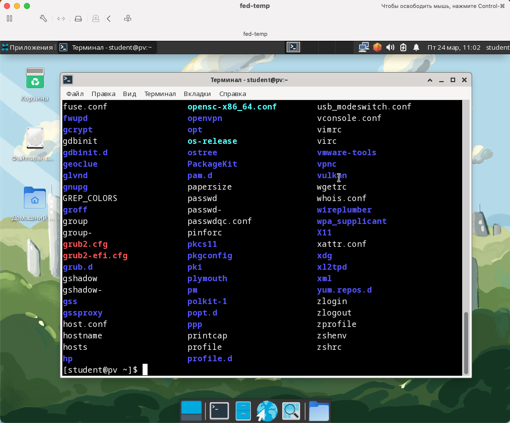

Просмотрите содержимое файла /etc/redhat-release
```bash
cat /etc/release
```

В меню "Приложения" найдите ярлык запускающий файловый менеджер
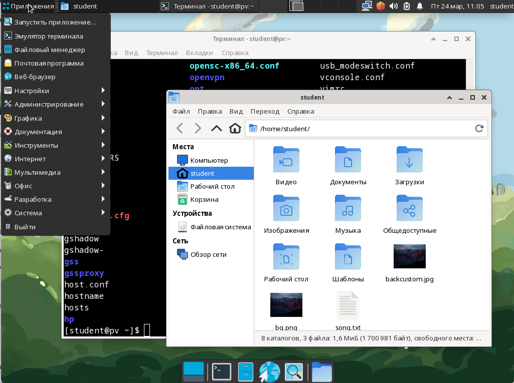

Просмотрите содержимое каталога /proc

Просмотрите содержимое файла /proc/version
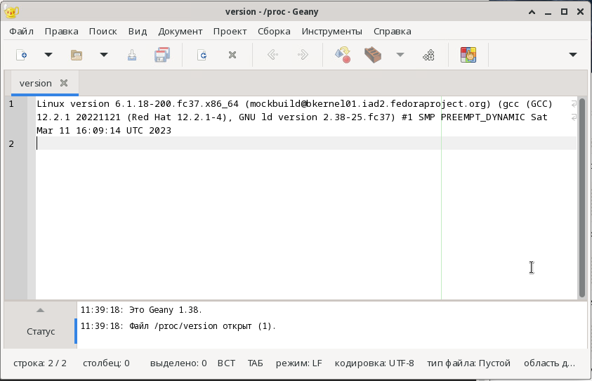

В меню "Приложения" найдите ярлык запускающий dnfdragora

В поиске dnfdragora найдите приложение codium
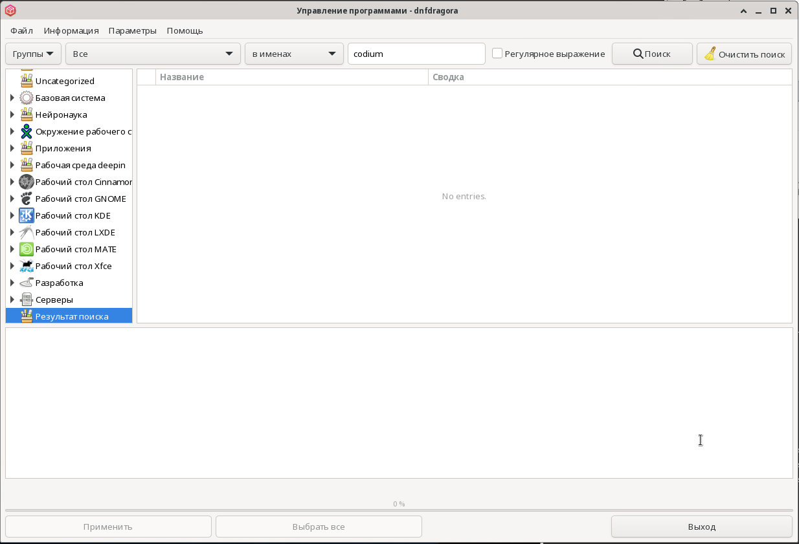

Перейдите в терминал и добавьте репозиторий и ключ репозитория vscodium (Воспользуйтесь инструкцией на сйте https://vscodium.com/#install)
```bash
sudo rpmkeys --import https://gitlab.com/paulcarroty/vscodium-deb-rpm-repo/-/raw/master/pub.gpg
printf "[gitlab.com_paulcarroty_vscodium_repo]\nname=download.vscodium.com\nbaseurl=https://download.vscodium.com/rpms/\nenabled=1\ngpgcheck=1\nrepo_gpgcheck=1\ngpgkey=https://gitlab.com/paulcarroty/vscodium-deb-rpm-repo/-/raw/master/pub.gpg\nmetadata_expire=1h" | sudo tee -a /etc/yum.repos.d/vscodium.repo
```
Установите vscodium (Воспользуйтесь инструкцией на сйте https://vscodium.com/#install) 
```bash
sudo dnf install codium
```
Убедитесь, что приложение установлено.

Перезапустите dnfdragora и попытайтесь снова найти codium. Что изменилось?
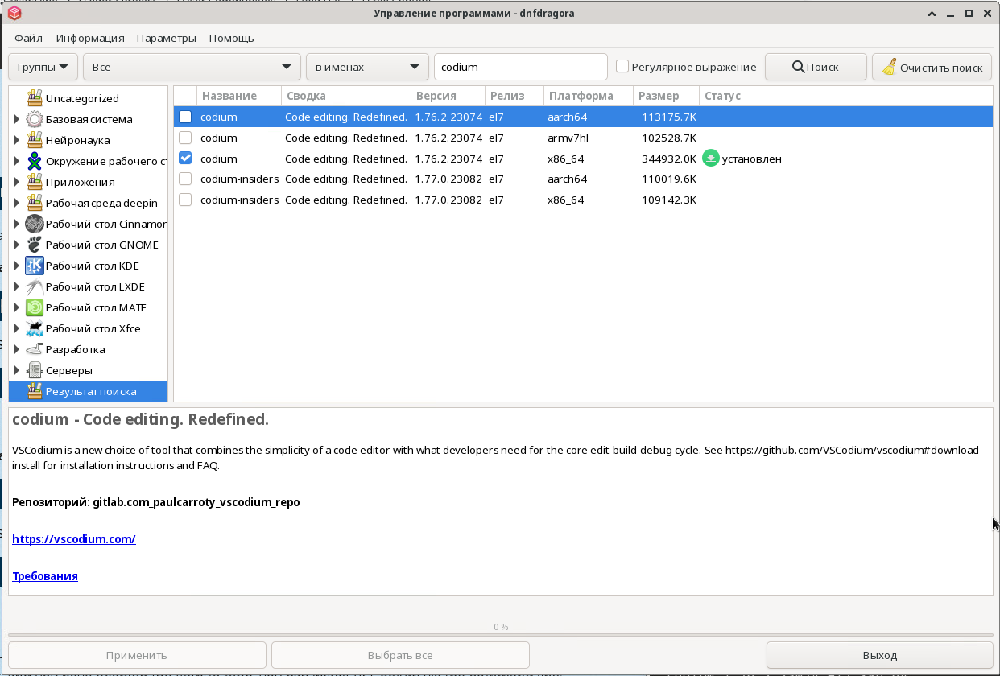

Установите приложение neovim
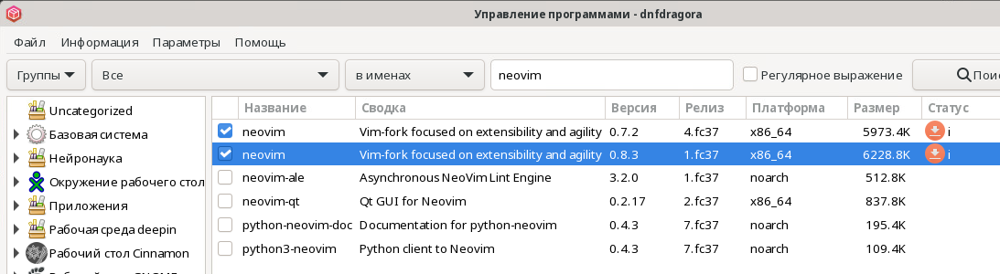

Переключитесь в консоль tty2 и войдите в систему под пользователем student.

*Решение:* Используйте комбинацию клавиш `Alt` `Ctrl` `F2` 

Откройте файл конфигурации .bashrc c помощью neovim (screenshot)
```bash
nvim .bashrc
```
Уточните сколько активных пользовательских подключений сейчас на вашем сервере (Отправить screenshot)
```bash
who
```
Переключитесь обратно в графическую сессию (информация о консоли доступна из предыдущего задания)
*Решение:* Используйте комбинацию клавиш `Alt` `Ctrl` `F1` 