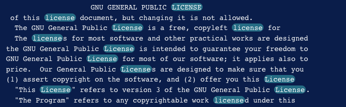
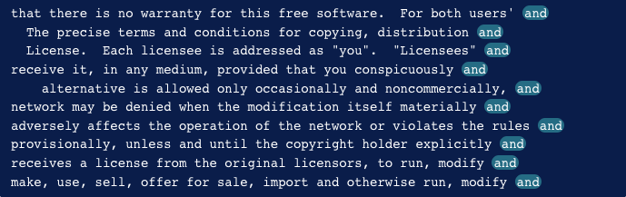
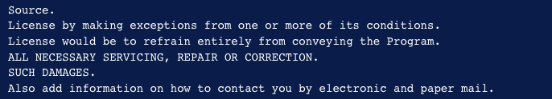

## LAB07-3. Инструменты работы с текстовым потоком. Утилита grep.

1. Скопируйте файл GPL-3 из сборника практических заданий или создайте файл с помощью следующей команды:

```bash
cat << 'EOF' > BSD
Copyright (c) The Regents of the University of California.
All rights reserved.

Redistribution and use in source and binary forms, with or without
modification, are permitted provided that the following conditions
are met:
1. Redistributions of source code must retain the above copyright
notice, this list of conditions and the following disclaimer.
1. Redistributions in binary form must reproduce the above copyright
notice, this list of conditions and the following disclaimer in the
documentation and/or other materials provided with the distribution.
1. Neither the name of the University nor the names of its contributors
may be used to endorse or promote products derived from this software
without specific prior written permission.

THIS SOFTWARE IS PROVIDED BY THE REGENTS AND CONTRIBUTORS ``AS IS'' AND
ANY EXPRESS OR IMPLIED WARRANTIES, INCLUDING, BUT NOT LIMITED TO, THE
IMPLIED WARRANTIES OF MERCHANTABILITY AND FITNESS FOR A PARTICULAR PURPOSE
ARE DISCLAIMED.  IN NO EVENT SHALL THE REGENTS OR CONTRIBUTORS BE LIABLE
FOR ANY DIRECT, INDIRECT, INCIDENTAL, SPECIAL, EXEMPLARY, OR CONSEQUENTIAL
DAMAGES (INCLUDING, BUT NOT LIMITED TO, PROCUREMENT OF SUBSTITUTE GOODS
OR SERVICES; LOSS OF USE, DATA, OR PROFITS; OR BUSINESS INTERRUPTION)
HOWEVER CAUSED AND ON ANY THEORY OF LIABILITY, WHETHER IN CONTRACT, STRICT
LIABILITY, OR TORT (INCLUDING NEGLIGENCE OR OTHERWISE) ARISING IN ANY WAY
OUT OF THE USE OF THIS SOFTWARE, EVEN IF ADVISED OF THE POSSIBILITY OF
SUCH DAMAGE.
EOF
```

```bash
curl -o GPL-3 https://www.gnu.org/licenses/gpl-3.0.txt
```

2. Выполните следующую команду, чтобы использовать **grep** для поиска каждой строки, содержащей слово GNU:

```bash
grep "GNU" GPL-3
```


3. Если вы хотите, чтобы grep игнорировал “регистр” вашего параметра поиска и выполнял поиск как в верхнем, так и в нижнем регистре, вы можете указать опцию **-i** или **--ignore-case**.

Найдите каждый экземпляр слова лицензия (с прописными, строчными или смешанными) в том же файле, что и раньше, с помощью следующей команды:

```bash
grep -i "license" GPL-3
```



4. Найдите каждую строку, которая не содержит слова **the** в лицензии BSD, с помощью следующей команды:

```bash
grep -v "the" BSD
```


5. Часто бывает полезно знать номер строки, в которой происходят совпадения. Вы можете сделать это, используя опцию **-n** или **--номер строки**. Повторно запустите предыдущий пример с добавлением этого флага:

```bash
grep -vn "the" BSD
```


>***Screenshot:***
>
>Cделайте скриншот экрана c результатом выполнения задания для отправки отчета.

6. Привязки - это специальные символы, которые указывают, где в строке должно произойти совпадение, чтобы оно было допустимым. Выполните следующую команду, чтобы выполнить поиск в файле GPL-3 и найти строки, где GNU встречается в самом начале строки

```bash
grep "^GNU" GPL-3
```


7. Эта команда будет соответствовать каждой строке, заканчивающейся словом `and` в файле GPL-3:

```bash
grep "and$" GPL-3
```




8. Чтобы сопоставить что-либо в файле GPL-3, содержащее два символа, а затем строку **cept**, вы должны использовать следующий шаблон:

```bash
grep "..cept" GPL-3
```


9. Поместив группу символов в квадратные скобки `[` и `]`, вы можете указать, что символом в этой позиции может быть любой символ, найденный в группе квадратных скобок.

Например, чтобы найти строки, содержащие too  или two, вам следует кратко указать эти варианты, используя следующий шаблон:

```bash
grep "t[wo]o" GPL-3
```


10. Вы можете заставить шаблон соответствовать чему угодно, кроме символов в квадратных скобках, начав список символов в квадратных скобках с символа **^**. Этот пример похож на pattern .ode, но не будет соответствовать шаблону code:

```bash
grep "[^c]ode" GPL-3
```


11. Если вы хотите найти каждую строку, начинающуюся с заглавной буквы, вы можете использовать следующий шаблон:

```bash
grep "^[A-Z]" GPL-3
```


12. Чтобы найти каждую строку в файле GPL-3, содержащую открывающую и закрывающую круглые скобки, между которыми только буквы и одиночные пробелы, используйте следующее выражение:

```bash
grep "([A-Za-z ]*)" GPL-3
```


13. Бывают случаи, когда вам потребуется выполнить **поиск буквальной точки** или **буквальной открывающей скобки**, особенно при работе с исходным кодом или файлами конфигурации. Поскольку эти символы имеют особое значение в регулярных выражениях, вам нужно “экранировать” эти символы, чтобы сообщить grep, что вы не хотите использовать их особое значение в данном случае.
Вы **экранируете символы**, используя символ обратной косой черты `\` перед символом, который обычно имеет особое значение.

13. Чтобы **найти любую строку**, начинающуюся с заглавной буквы и заканчивающуюся точкой, используйте следующее выражение, которое исключает конечную точку, чтобы она представляла буквальную точку вместо обычного значения “любой символ”.:

```bash
grep "^[A-Z].*\.$" GPL-3
```



14. Чтобы указать чередование, используйте символ канала **`|`**. Они часто используются в рамках группировки в скобках, чтобы указать, что одна из двух или более возможностей должна рассматриваться как совпадающая.

В приведенном ниже тексте вы найдете либо GPL, либо General Public License:
```bash
grep -E "(GPL|General Public License)" GPL-3
```


Чередование позволяет выбирать между более чем двумя вариантами, добавляя дополнительные варианты в пределах группы выбора, разделенные дополнительными символами канала **`|`**.

>***Screenshot:***
>
>Cделайте скриншот экрана c результатом выполнения задания для отправки отчета.

15. Подобно метасимволу **`*`**, который соответствовал предыдущему символу или набору символов ноль или более раз, в расширенных регулярных выражениях доступны другие метасимволы, которые определяют количество вхождений.

Чтобы сопоставить символ ноль или один раз, вы можете использовать символ **`?`**. Это делает символ или наборы символов, которые были раньше, по сути, необязательными.

16. Следующая  команда ищет copyright и right, помещая copy в необязательную группу:

```bash
grep -E "(copy)?right" GPL-3
```


Символ **`+`** соответствует выражению один или несколько раз. Это почти как мета-символ **`*`**, но с символом **`+`** выражение должно совпадать хотя бы один раз. Следующее выражение соответствует строке free плюс один или несколько символов, которые не являются пробелами:

```bash
grep -E "free[^[:space:]]+" GPL-3
```


17. Чтобы указать, сколько раз повторяется совпадение, используйте символы фигурной скобки **`{`** и **`}`**. Эти символы позволяют указать точное число, диапазон или верхнюю или нижнюю границы количества совпадений выражения.

18. Используйте следующее выражение, чтобы найти все строки в файле GPL-3, содержащие тройные гласные:

```bash
grep -E "[AEIOUaeiou]{3}" GPL-3
```


19. Чтобы найти любые слова, содержащие от 16 до 20 символов, используйте следующее выражение:

```bash
grep -E "[[:alpha:]]{16,20}" GPL-3
```


